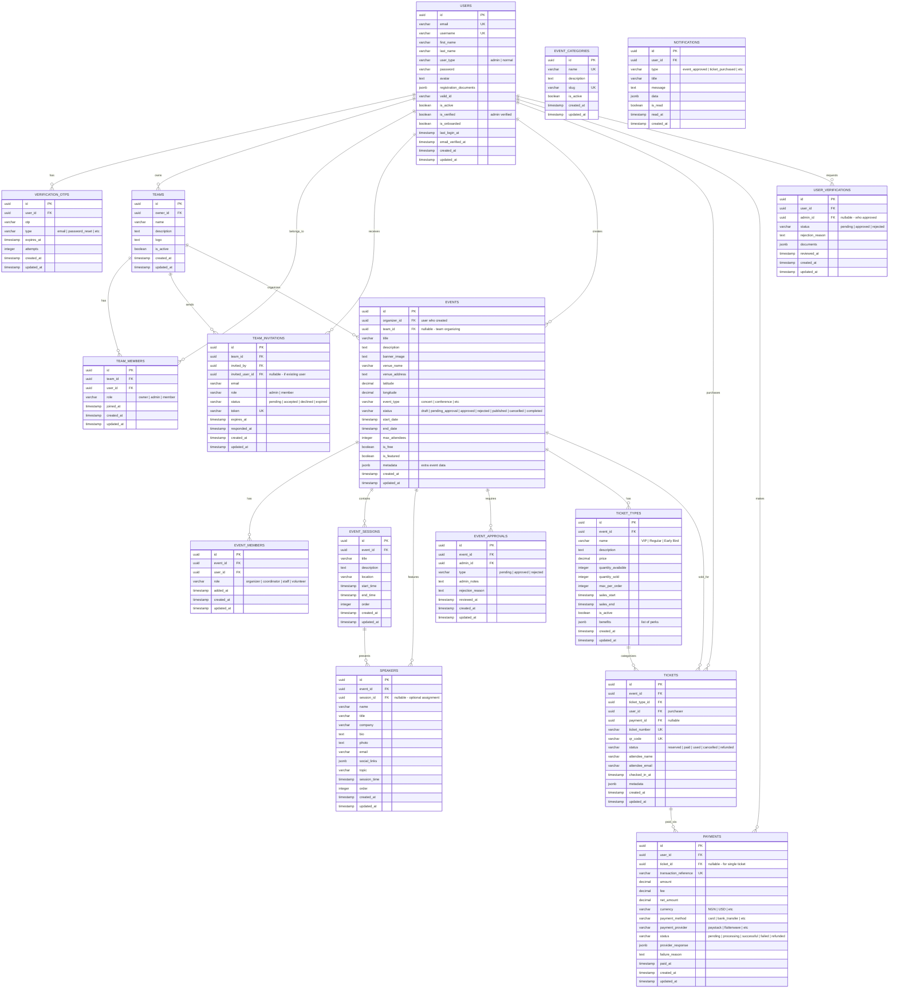

# Tickeur Database Schema Diagram

## Entity Relationship Diagram (Mermaid)



## Table Descriptions

### Core User Management
- **USERS**: Main user table with verification status and user types (admin/normal)
- **VERIFICATION_OTPS**: Email/phone verification codes

### Team Management
- **TEAMS**: Organizations/teams that can organize events
- **TEAM_MEMBERS**: Users belonging to teams with roles
- **TEAM_INVITATIONS**: Pending invitations to join teams

### Event Management
- **EVENTS**: Main events table with approval workflow
- **EVENT_MEMBERS**: Team members assigned to specific events
- **EVENT_SESSIONS**: Sessions/tracks within an event (optional)
- **SPEAKERS**: Speakers/presenters for events (optionally assigned to sessions)
- **EVENT_APPROVALS**: Admin approval history for events
- **EVENT_CATEGORIES**: Categories for organizing events
- **TICKET_TYPES**: Different ticket tiers for events

### Ticketing & Payments
- **TICKETS**: Individual tickets purchased by users
- **PAYMENTS**: Payment transactions for tickets

### Communication
- **NOTIFICATIONS**: In-app notifications for users

## Key Workflows

### 1. User Verification Flow
1. User registers -> `is_verified = false`
2. User submits documents -> `USER_VERIFICATIONS` record created with `status = pending`
3. Admin reviews -> Updates `USER_VERIFICATIONS.status` and `USERS.is_verified`

### 2. Event Creation & Approval
1. Verified user creates event -> `EVENTS.status = draft`
2. User submits for approval -> `status = pending_approval`
3. Admin reviews -> Creates `EVENT_APPROVALS` record
4. If approved -> `status = approved`, user can publish
5. User publishes -> `status = published`

### 3. Ticket Purchase Flow
1. User selects ticket type -> `TICKETS` created with `status = reserved`
2. Payment initiated -> `PAYMENTS` created with `status = pending`
3. Payment successful -> `PAYMENTS.status = successful`, `TICKETS.status = paid`
4. QR code generated for ticket

### 4. Team Invitation Flow
1. Team owner/admin sends invite -> `TEAM_INVITATIONS` created
2. User receives notification
3. User accepts -> `TEAM_MEMBERS` record created, invitation status updated

## Indexes to Consider

```sql
-- Users
CREATE INDEX idx_users_email ON users(email);
CREATE INDEX idx_users_user_type ON users(user_type);
CREATE INDEX idx_users_is_verified ON users(is_verified);

-- Events
CREATE INDEX idx_events_organizer ON events(organizer_id);
CREATE INDEX idx_events_team ON events(team_id);
CREATE INDEX idx_events_status ON events(status);
CREATE INDEX idx_events_start_date ON events(start_date);

-- Tickets
CREATE INDEX idx_tickets_event ON tickets(event_id);
CREATE INDEX idx_tickets_user ON tickets(user_id);
CREATE INDEX idx_tickets_status ON tickets(status);

-- Payments
CREATE INDEX idx_payments_user ON payments(user_id);
CREATE INDEX idx_payments_status ON payments(status);

-- Team Members
CREATE INDEX idx_team_members_team ON team_members(team_id);
CREATE INDEX idx_team_members_user ON team_members(user_id);
```

## Status Enums

### User Verification Status
- `pending` - Awaiting admin review
- `approved` - Verified by admin
- `rejected` - Rejected with reason

### Event Status
- `draft` - Being created
- `pending_approval` - Submitted for admin approval
- `approved` - Approved, can be published
- `rejected` - Rejected by admin
- `published` - Live and visible
- `cancelled` - Event cancelled
- `completed` - Event has ended

### Ticket Status
- `reserved` - Held during checkout
- `paid` - Payment confirmed
- `used` - Checked in at event
- `cancelled` - Cancelled before event
- `refunded` - Money returned

### Payment Status
- `pending` - Initiated
- `processing` - Being processed
- `successful` - Completed
- `failed` - Failed
- `refunded` - Refunded

### Team Invitation Status
- `pending` - Awaiting response
- `accepted` - User joined team
- `declined` - User declined
- `expired` - Invitation expired
